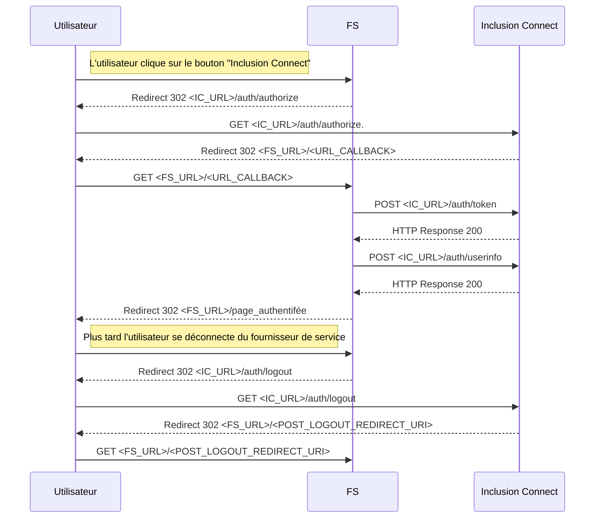

# Utiliser Inclusion Connect pour authentifier des utilisateurs

Afin d'implémenter Inclusion Connect, il faut un compte pour votre <abbr>FS</abbr> (Fournisseur de Service) sur les plateformes d'intégration et de production.

- Vous pouvez observer l'ensemble des parcours utilisateurs à [cette page](user_journey.md)
- Pour plus de détail sur les différents _endpoints_ vous pouvez continuer à lire cette page.

Contactez l'équipe du projet pour obtenir les variables de production et de recette.

## Nos endpoints

Le format des urls est le suivant :

|               |                                       |
|           --- | ---                                   |
| Authorization | https://{hostname}/auth/authorize     |
| Registration  | https://{hostname}/auth/register      |
| Activation    | https://{hostname}/auth/activate      |
| Token         | https://{hostname}/auth/token         |
| UserInfo      | https://{hostname}/auth/userinfo      |
| Logout        | https://{hostname}/auth/logout        |


D'un point de vue OpenID Connect, les end-points Authorization, Registration et Activation
sont identiques. La seule chose qui change est si l'utilisateur n'est pas connecté, dans ce cas on
le redirige vers une vue différente pour chaque end-point.

Le hostname dépend de l'instance utilisée :
- https://connect.inclusion.beta.gouv.fr/ pour la production
- https://recette.connect.inclusion.beta.gouv.fr/ pour la recette
- http://127.0.0.1:8080 pour l'environnement local

## Détail du fonctionnement



## Détail des flux

Le détail des flux peut être trouvé en anglais ici :
- https://openid.net/specs/openid-connect-core-1_0.html
- https://openid.net/specs/openid-connect-rpinitiated-1_0.html

### 1) Authentification / Création de compte / Activation de compte

#### Description

- Contexte : Le FS redirige l'utilisateur vers l'endpoint _Authorization_ pour engager la cinématique d'authentification.
- Origine : FS
- Cible : Inclusion Connect
- Type d'appel : redirection navigateur

#### Requête (Authentification)

- URL : `https://{hostname}/auth/authorize?response_type=code&client_id=<CLIENT_ID>&redirect_uri=<FS_URL>%2F<URL_CALLBACK>&scope=<SCOPES>&state=><STATE>&nonce=<NONCE>`
- Méthode : GET

Les paramètres sont les suivants :
- **response_type** : Le type de cinématique d'authentification utilisée. Comme nous n'utilisons que le _Authorization Code Flow_ la valeur à donner est `code`.
- **client_id** : l'identifiant du FS.
- **redirect_uri** : l'uri de redirection à laquelle sera envoyée la réponse d'Inclusion Connect.
- **scope** : les ressources auxquelles on souhaite avoir accès. Il faut utiliser `openid profile email`.
- **state** : valeur générée aléatoirement par le FS qu'Inclusion Connect renvoie tel quel dans la réponse à cet appel pour être ensuite vérifié par le FS. Il est utilisé afin d’empêcher l’exploitation de failles CSRF.
- **nonce** : valeur générée aléatoirement par le FS qu'Inclusion Connect renvoie tel quel dans la réponse à l'appel à /token, pour être ensuite vérifié par le FS. Il est utilisé pour empêcher les attaques par rejeu.
- **login_hint**: paramètre optionnel servant à pré-remplir une adresse e-mail dans les différents formulaires de connexion / création de compte. Lorsque ce paramètre est fourni, il n'est pas possible de changer l'adresse email pré-remplie.

/!\ Attention : si l'utilisateur est déjà connecté avec un autre email, Inclusion Connect acceptera automatiquement la demande de connexion, et l'email ne correspondra donc pas a celui donné dans login_hint. Il faut donc que le FS vérifie que l'email est identique de son côté.

Une fois sur Inclusion Connect, il y a 3 possibilités.
- Si c'est un nouvel utilisateur, il devra se créer un compte, puis recevra un email de vérification d'adresse email qui le renverra sur Inclusion Connect avant d'être redirigé sur **redirect_uri**.
- Si c'est un utilisateur existant non connecté, il devra entrer ses identifiants et sera ensuite redirigé sur **redirect_uri**.
- Si c'est un utilisateur déjà connecté, il sera directement redirigé sur **redirect_uri**.

#### Requête (Création de compte)

Il est possible d'utiliser l'endpoint _Registration_ pour que l'utilisateur arrive directement sur cette seconde page.

- URL : `https://{hostname}/auth/register?response_type=code&client_id=<CLIENT_ID>&redirect_uri=<FS_URL>%2F<URL_CALLBACK>&scope=<SCOPES>&state=><STATE>&nonce=<NONCE>`
- Méthode : GET

Les paramètres sont les mêmes que pour l'Authentification.

#### Requête (Activation de compte)

Il est possible d'utiliser l'endpoint _Activation_ pour que l'utilisateur arrive directement sur une page de création de compte pré-remplie.

- URL : `https://{hostname}/auth/activate?response_type=code&client_id=<CLIENT_ID>&redirect_uri=<FS_URL>%2F<URL_CALLBACK>&scope=<SCOPES>&state=><STATE>&nonce=<NONCE>`
- Méthode : GET

Les paramètres sont les mêmes que pour l'Authentification, plus :
- **login_hint**: devient obligatoire
- **firstname**: permet de pré-remplir le prénom de l'utilisateur
- **lastname**: permet de pré-remplir le nom de famille de l'utilisateur
Sur cette page, ces informations ne sont pas modifiables. Cela permet de s'assurer qu'un utilisateur existant d'une plateforme qui migre son compte à Inclusion Connect ne change pas ses informations personnelles.

#### Réponse

HTTP 302 - Redirection vers **redirect_uri***

### 2) Réponse à l'authentification

#### Description

- Contexte : L'utilisateur a complété la cinématique sur Inclusion Connect qui appelle le callback du FS avec un code d'autorisation dans l'URL.
- Origine : Inclusion Connect
- Cible : FS
- Type d'appel : redirection navigateur

#### Requête

- URL : `<FS_URL>/<URL_CALLBACK>?code=<AUTHZ_CODE>"&state=<STATE>`
- Méthode : GET

Les paramètres sont les suivants :
- **code** : code à réutiliser lors de l'appel sur le endpoint _Token_.
- **state** : la valeur passée lors de l'appel à l'endpoint _Authorisation_ et qu'il faut donc vérifier par sécurité.

### 3) Récupération d'un _Access Token_

#### Description

- Contexte : Le FS a reçu le code d'autorisation. Il doit maintenant demander un _access token_ à Inclusion Connect.
- Origine : FS
- Cible : Inclusion Connect
- Type d'appel : appel de web service

#### Requête

- URL : `https://{hostname}/auth/token`
- Méthode : POST
- Header attendu: `Content-Type: application/x-www-form-urlencoded`
- Body: au format `key1=value1&key2=value2` (adapté au content-type `application/x-www-form-urlencoded` )

Voici le payload à envoyer :
- **grant_type**' : `authorization_code` (valeur imposée par le protocol).
- **redirect_uri**' : à nouveau LA MÊME uri de redirection passée à l'endpoint _Authorization_ '<FS_URL>/<CALLBACK_URL_DATA>'.
- **client_id** : l'identifiant du FS.
- **client_secret** : le secret du FS correspondant à son identifiant.
- **code** : le code reçu en réponse à la requête d'authentification.


#### Réponse

Corps HTTP:
```
{
  'access_token': <ACCESS_TOKEN>,
  'token_type': 'Bearer',
  'expires_in': 60,
  'id_token': <ID_TOKEN>
}
```

L'_access token_ sera ensuite utilisé pour accéder à l'endpoint _UserInfo_.

L'_id token_ est un objet JWT signé qui contient notamment :
- **nonce** : la valeur transmise lors de la requête initiale qu'il faut vérifier.
- **sub** : l'identifiant unique de l'utilisateur que le FS doit conserver au cas où l'utilisateur change son adresse e-mail un jour.
- **given_name** : le prénom de l'utilisateur.
- **family_name** : son nom de famille.
- **email** : son adresse e-mail.


La signature du token est chiffrée avec l'algorithme `RS256` et il est possible de récupérer la clé publique pour vérifier la signature.

Cependant, dans le cas où l'_access token_ est  récupéré via un appel direct du _backend_ au _OpendID Connect provider_ (Inclusion Connect)
et non par exemple récupéré par le _frontend_ puis transmis au _backend_, la validation du token ne protège pas grand-chose.
En effet, si Inclusion Connect a été compromis, ou si ses réponses sont modifiées par un attaquant, alors celui-ci pourra vraisemblablement
aussi modifier la réponse de l'endpoint pour récupérer la clé publique et y mettre la sienne.

Ce cas précis est d'ailleurs mentionné dans le document de l'IETF "OAuth 2.0 for Browser-Based Apps" :
https://datatracker.ietf.org/doc/html/draft-ietf-oauth-browser-based-apps#section-9.8.3

> Performing OpenID Connect using the Authorization Code flow provides the benefit of the client not needing to verify the JWT signature,
> as the ID token will have been fetched over an HTTPS connection directly from the authorization server.

### 4) Récupération des informations de l'utilisateur

Note: Cette étape est actuellement facultative car toutes les informations que l'on peut récupérer sur cet endpoint
sont déjà présentent dans l'id_token.

#### Description

- Contexte : Le FS interroge Inclusion Connect pour récupérer les informations de l'utilisateur.
- Origine : FS
- Cible : Inclusion Connect
- Type d'appel : appel de web service

#### Requête

- URL :  `https://{hostname}/auth/userinfo`
- Méthode : GET. La transmission de l'_access_token_ DOIT se faire dans le header `Authorization : Bearer <Token>`.

#### Réponse

Corps HTTP:
```
{
    'sub': <l'identifiant unique de l'utilisateur>
    'given_name': <prénom>,
    'family_name': <nom de famille>
    'email': <l'email>
}
```

Note : il faut que le FS conserve la valeur de sub en base de donnée car c'est celle-ci qui permettra d'identifier l'utilisateur s'il choisit de changer
son adresse email dans Inclusion Connect.

### 5) Déconnexion

Lorsqu'un utilisateur se déconnecte d'un FS, on s'attend à ce que le FS appelle l'endpoint _Logout_ d'Inclusion Connect.

Cela peut être fait de deux manières :

#### Sans confirmation

On redirige l'utilisateur sur `https://{hostname}/auth/logout?state=<STATE>&id_token_hint=<ID_TOKEN>&post_logout_redirect_uri=<FS_URL>%2F<POST_LOGOUT_REDIRECT_URI>`
qui sera ensuite redirigé vers l'url passée avec le paramètre **post_logout_redirect_uri**.


#### Avec confirmation

Si le `STATE` et/ou l'`ID_TOKEN` ne sont pas disponibles, il est possible de déconnecter l'utilisateur avec une redirection vers `https://{hostname}/auth/logout?client_id=<CLIENT_ID>&post_logout_redirect_uri=<FS_URL>%2F<POST_LOGOUT_REDIRECT_URI>`.
Dans ce cas, l'utilisateur devra confirmer sa volonté de se deconnecter d'Inclusion Connect et sera ensuite redirigé vers l'url passée avec le paramètre **post_logout_redirect_uri**.
