# Parcours utilisateur sur Inclusion Connect

Ce document liste les différents parcours utilisateurs.

Vous trouverez à chaque fois un lien (pour un environnement local) afin d’entrer sur le parcours et pouvoir le tester.

Les URLs de retour sont configurées pour un setup local des emplois de l’inclusion. Cela fonctionne également sans avoir ce setup, vous finirez juste sur une page “Unable to connect”

## Parcours de création de compte - Nouvel utilisateur

- 

  
1) Arrivée sur la page de connexion

  

  - 

    
**[DEV]** : Url et paramètres d’accès direct à la page:

    http://0.0.0.0:8080/auth/authorize?response_type=code&client_id=local_inclusion_connect&redirect_uri=http%3A%2F%2F127.0.0.1%3A8000%2Finclusion_connect%2Fcallback&scope=openid+profile+email&state=0xGVKT6eO9NT%3Aarn7NqGqozXjsvio5CAmU2lpoF2nJmLTlU9OuaHAtOg&nonce=r04v4u8sT05W

    L’url est celle de l’endpoint Authorization: `https://{hostname}/auth/authorize`

    Les paramètres à renseigner sont:

    - `**response_type**` : La valeur `code`
    - `**client_id**` : Le `CLIENT_ID` qui vous été fourni
    - `**redirect_uri**` : L’url à laquelle sera redirigée l’utilisateur à la fin du processus sur Inclusion Connect
    - `**scope**` : La valeur `openid profile email`
    - `**state**` : Une valeur généré par votre application ([voir documentation sur github pour plus de détail](inclusion_connect.md#requête-authentification))
    - `**nonce**` : Une autre valeur généré par votre application ([voir documentation sur github pour plus de détail](inclusion_connect.md#requête-authentification))

    

- 

  
2) L’utilisateur clique sur “Créer un compte” (ou alors il arrive directement sur cette page)

  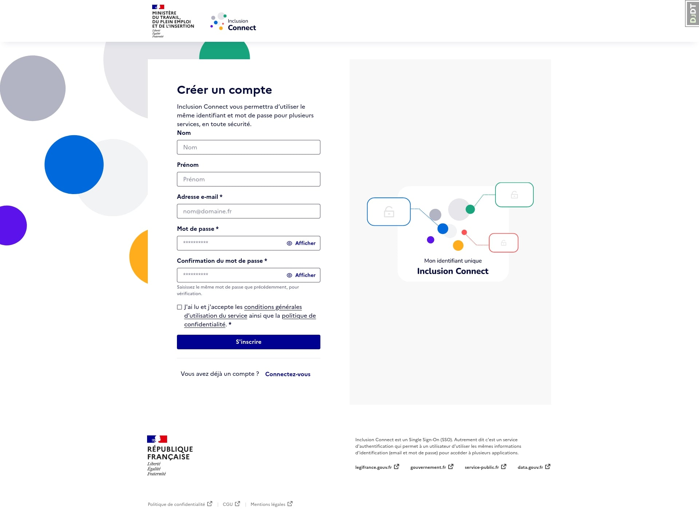

  - 

    
**[DEV]** : Url et paramètres d’accès direct à la page:

    http://0.0.0.0:8080/auth/register?response_type=code&client_id=local_inclusion_connect&redirect_uri=http%3A%2F%2F127.0.0.1%3A8000%2Finclusion_connect%2Fcallback&scope=openid+profile+email&state=0xGVKT6eO9NT%3Aarn7NqGqozXjsvio5CAmU2lpoF2nJmLTlU9OuaHAtOg&nonce=r04v4u8sT05W&from=emplois

    L’url est celle de l’endpoint Registration: `https://{hostname}/auth/register`

    Les paramètres à renseigner sont:

    - `**response_type**` : La valeur `code`
    - `**client_id**` : Le `CLIENT_ID` qui vous été fourni
    - `**redirect_uri**` : L’url à laquelle sera redirigée l’utilisateur à la fin du processus sur Inclusion Connect
    - `**scope**` : La valeur `openid profile email`
    - `**state**` : Une valeur généré par votre application ([voir documentation sur github pour plus de détail](inclusion_connect.md#requête-authentification))
    - `**nonce**` : Une autre valeur généré par votre application ([voir documentation sur github pour plus de détail](inclusion_connect.md#requête-authentification))

  

- 

  
3) L’utilisateur clique sur “Créer un compte” et Inclusion Connect envoie l’e-mail de vérification

  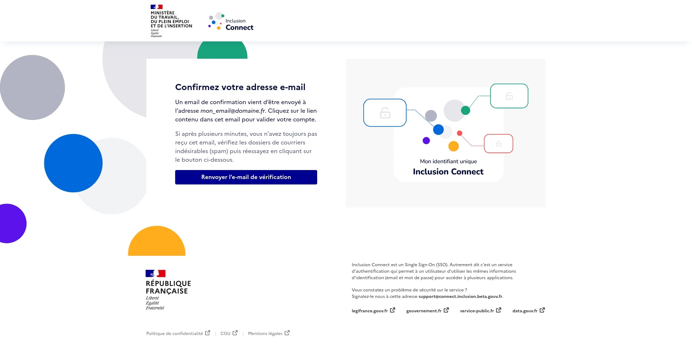

- 

  
4) L’utilisateur clique sur le lien dans l’e-mail

  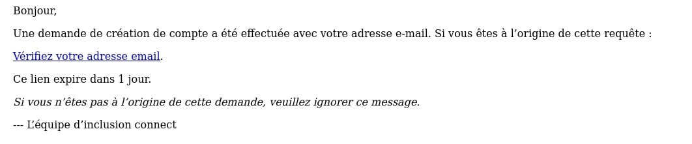

- 

  
5) L’utilisateur est redirigé vers la plateforme depuis laquelle il est parti

  Le compte sur la plateforme est créé à ce moment là.

## Parcours de connexion

- 

  
1) Arrivée sur la page de connexion

  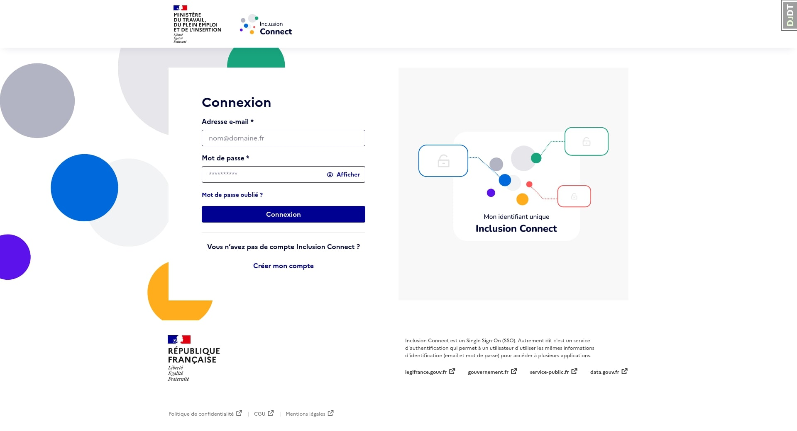

  - 

    
**[DEV]** : Url et paramètres d’accès direct à la page:

    http://0.0.0.0:8080/auth/authorize?response_type=code&client_id=local_inclusion_connect&redirect_uri=http%3A%2F%2F127.0.0.1%3A8000%2Finclusion_connect%2Fcallback&scope=openid+profile+email&state=0xGVKT6eO9NT%3Aarn7NqGqozXjsvio5CAmU2lpoF2nJmLTlU9OuaHAtOg&nonce=r04v4u8sT05W

    L’url est celle de l’endpoint Authorization: `https://{hostname}/auth/authorize`

    Les paramètres à renseigner sont:

    - `**response_type**` : La valeur `code`
    - `**client_id**` : Le `CLIENT_ID` qui vous été fourni
    - `**redirect_uri**` : L’url à laquelle sera redirigée l’utilisateur à la fin du processus sur Inclusion Connect
    - `**scope**` : La valeur `openid profile email`
    - `**state**` : Une valeur généré par votre application ([voir documentation sur github pour plus de détail](inclusion_connect.md#requête-authentification))
    - `**nonce**` : Une autre valeur généré par votre application ([voir documentation sur github pour plus de détail](inclusion_connect.md#requête-authentification))

  

- 

  
2) L’utilisateur saisit son login/mdp, clique sur “Se connecter” et est redirigé vers la plateforme depuis laquelle il est parti

## Parcours de ré-initialisation de mot de passe oublié

- 

  
1) Arrivée sur la page de connexion

  

  - 

    
**[DEV]** : Url et paramètres d’accès direct à la page:

    http://0.0.0.0:8080/auth/authorize?response_type=code&client_id=local_inclusion_connect&redirect_uri=http%3A%2F%2F127.0.0.1%3A8000%2Finclusion_connect%2Fcallback&scope=openid+profile+email&state=0xGVKT6eO9NT%3Aarn7NqGqozXjsvio5CAmU2lpoF2nJmLTlU9OuaHAtOg&nonce=r04v4u8sT05W

    L’url est celle de l’endpoint Authorization: `https://{hostname}/auth/authorize`

    Les paramètres à renseigner sont:

    - `**response_type**` : La valeur `code`
    - `**client_id**` : Le `CLIENT_ID` qui vous été fourni
    - `**redirect_uri**` : L’url à laquelle sera redirigée l’utilisateur à la fin du processus sur Inclusion Connect
    - `**scope**` : La valeur `openid profile email`
    - `**state**` : Une valeur généré par votre application ([voir documentation sur github pour plus de détail](inclusion_connect.md#requête-authentification))
    - `**nonce**` : Une autre valeur généré par votre application ([voir documentation sur github pour plus de détail](inclusion_connect.md#requête-authentification))

  

- 

  
2) L’utilisateur clique sur “Mot de passe oublié”

  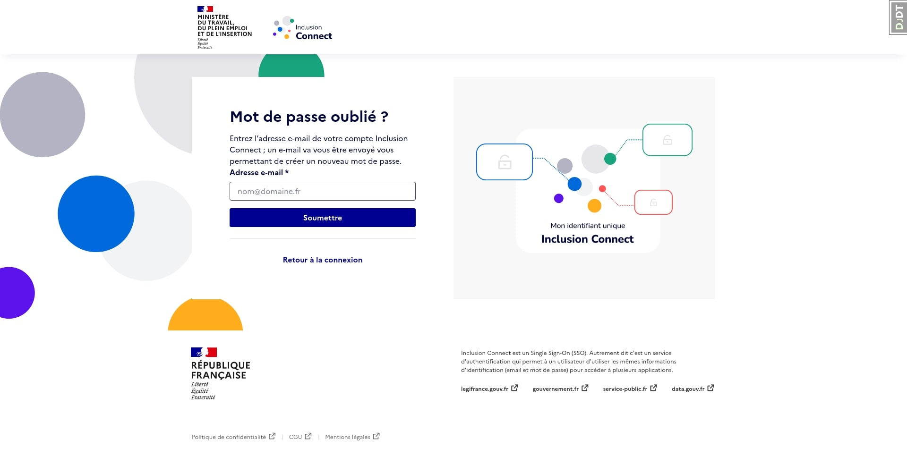

- 

  
3) L’utilisateur saisi son email et clique sur “Soumettre”

  L’utilisateur est redirigé vers la page de connexion et un email est envoyé

  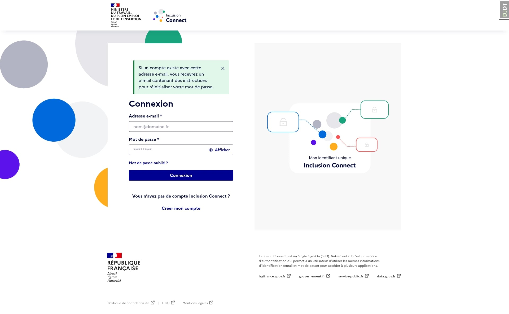

- 

  
4) L’utilisateur clique sur le lien dans l’e-mail

  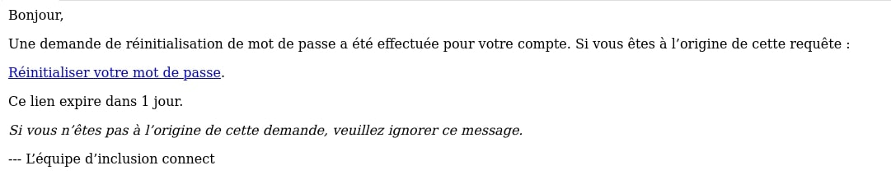

- 

  
5) L’utilisateur arrive sur le formulaire de ré-initialisation de mot de passe

  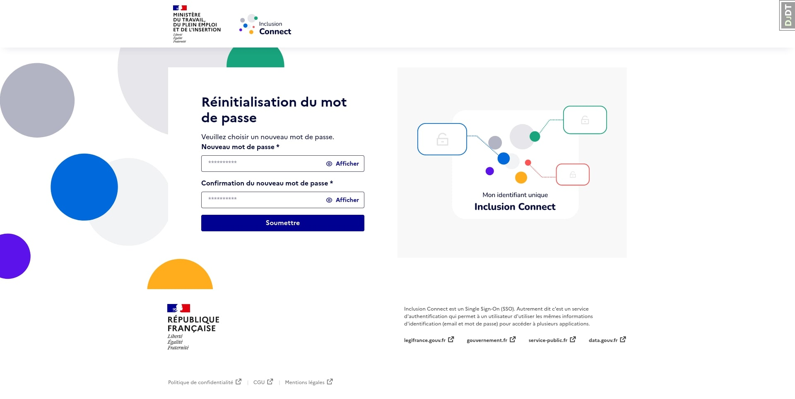

- 

  
6) L’utilisateur rentre un nouveau mot de passe et clique sur “Soumettre” et est redirigé vers la plateforme

## Parcours de migration de compte

- 

  
1) La plateforme envoi l’utilisateur directement sur la page de création de compte en pré-remplissant les champs email / prénom / nom

  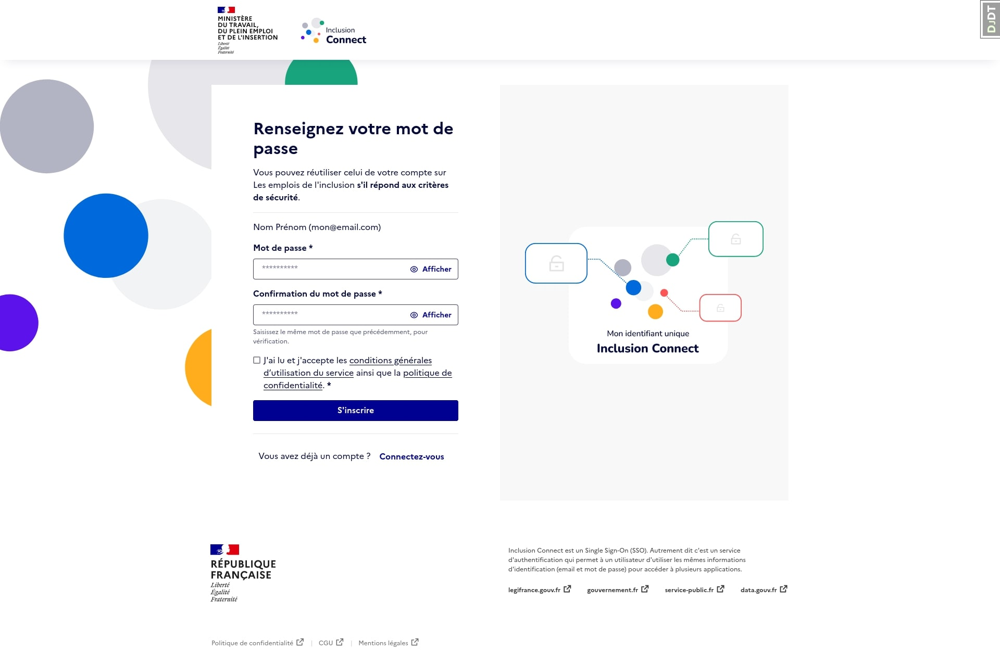

  - 

    
**[DEV]** : Url et paramètres d’accès direct à la page:

    http://0.0.0.0:8080/auth/activate?response_type=code&client_id=local_inclusion_connect&redirect_uri=http%3A%2F%2F127.0.0.1%3A8000%2Finclusion_connect%2Fcallback&scope=openid+profile+email&state=mJGvp3qwBMkD%3AYedrAibh8pHw0yx3mY8-L2Zp-vhLe8D-rL2aClHm9zQ&nonce=CbBAoMxEUIJR&login_hint=mon%40email.com&lastname=Nom&firstname=Pr%C3%A9nom

    L’url est celle de l’endpoint Registration: `https://{hostname}/auth/activate`

    Les paramètres à renseigner sont:

    - `**response_type**` : La valeur `code`
    - `**client_id**` : Le `CLIENT_ID` qui vous été fourni
    - `**redirect_uri**` : L’url à laquelle sera redirigée l’utilisateur à la fin du processus sur Inclusion Connect
    - `**scope**` : La valeur `openid profile email`
    - `**state**` : Une valeur généré par votre application ([voir documentation sur github pour plus de détail](inclusion_connect.md#requête-authentification))
    - `**nonce**` : Une autre valeur généré par votre application ([voir documentation sur github pour plus de détail](inclusion_connect.md#requête-authentification))
    - **`login_hint`** pour l’email
    - **`firstname`** pour le prénom
    - **`lastname`** pour le nom

    Les paramètres **`login_hint` `firstname`** et **`lastname`** sont obligatoires (une erreur `Missing activation parameters` sera affichée dans le cas où l’un manque)

  

La suite du parcours est le même que pour le [Parcours de création de compte - Nouvel utilisateur](#Parcours-de-création-de-compte---Nouvel-utilisateur)

## Déconnexion en passant par la page Inclusion Connect

La déconnexion peut être faite de deux manières:

- 

  
soit transparente (l’utilisateur ne voit pas Inclusion Connect)

  - 

    
**[DEV]** : Url et paramètres d’accès direct à la page:

    Pas d’accès direct vu qu’il faut l’`id_token`

    L’url est celle de l’endpoint Logout: `https://{hostname}/realms/{realm-name}/protocol/openid-connect/logout`

    Les paramètres à renseigner sont:

    - `**id_token_hint**` : l’`id_token` récupéré à l’étape de connexion de l’utilisateur
    - `**post_logout_redirect_uri**` : L’url à laquelle sera redirigée l’utilisateur après avoir été déconnecté

  

- 

  
soit en affichant la page de déconnexion d’Inclusion Connect

  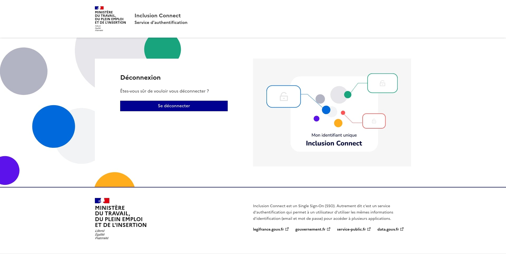

  - 

    
**[DEV]** : Url et paramètres d’accès direct à la page:

    http://0.0.0.0:8080/realms/local/protocol/openid-connect/logout?client_id=local_inclusion_connect&post_logout_redirect_uri=http%3A%2F%2F127.0.0.1%3A8000

    L’url est celle de l’endpoint Logout: `https://{hostname}/realms/{realm-name}/protocol/openid-connect/logout`

    Les paramètres à renseigner sont:

    - `**client_id**` : Le `CLIENT_ID` qui vous été fourni
    - `**post_logout_redirect_uri**` : L’url à laquelle sera redirigée l’utilisateur àprès avoir été decconecté

  

## Modification des informations personnelles

On peut accéder à l’espace « mon compte » pour modifier son email, nom, prénom et mot de passe.

Il faut d’abord se connecter sur Inclusion Connect.

Afin que les informations personnelles de l’utilisateur soient mises à jour sur la plateforme, il faut que la plateforme refasse une connexion à Inclusion Connect. Le mieux est donc de rediriger l’utilisateur vers le tunnel de connexion de la plateforme pour que la cinématique de connexion soit immédiatement refaite.

Pour se faire, il faut passer les paramètres (`referrer` et `referrer_uri`, voir paramètres DEV plus bas)

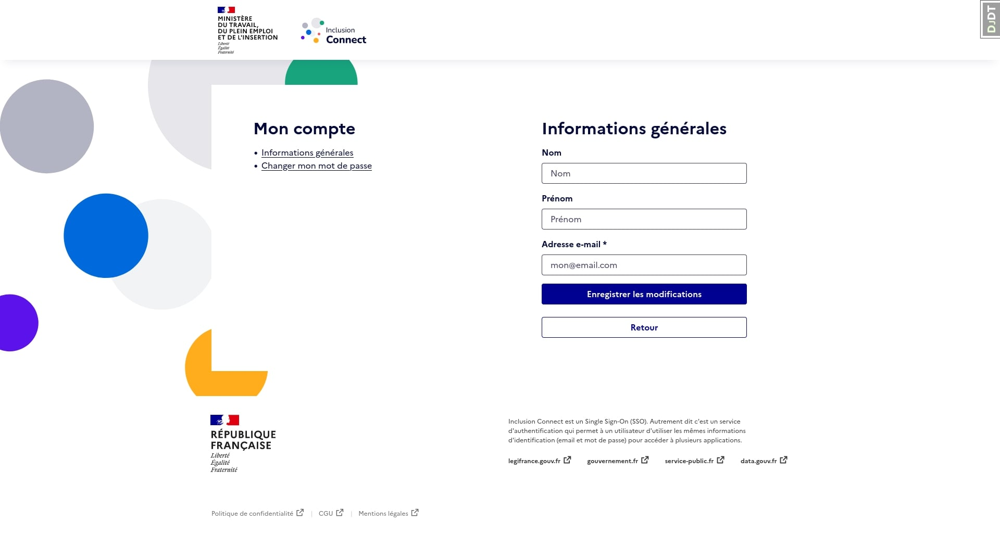

- 

  
**[DEV]** : Url et paramètres d’accès direct à la page:

  http://0.0.0.0:8080/accounts/my-account?referrer=local_inclusion_connect&referrer_uri=http%3A%2F%2F127.0.0.1%3A8000%2Finclusion_connect%2Fauthorize%3Fnext_url%3Dhttp%253A%252F%252F127.0.0.1%253A8000%252Fdashboard%252Fedit_user_info%26user_kind%3Dprescriber

  L’url est : `https://{hostname}/accounts/my-account`

  Les paramètres à renseigner :

  - `**referrer**` : Le `CLIENT_ID` qui vous été fourni
  - `**referrer_uri**` : L’url à laquelle sera redirigée l’utilisateur après avoir modifié ces informations personnelles.

  Vous **devez** renseigner ces deux paramètres pour que le bouton de renvoi vers l’application soit affiché.

